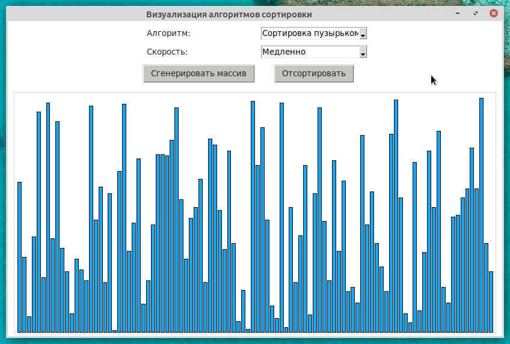
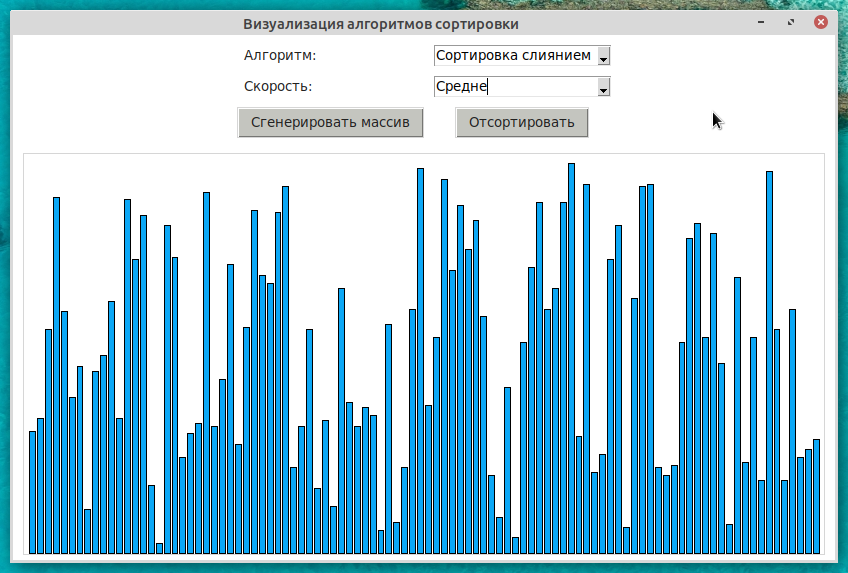
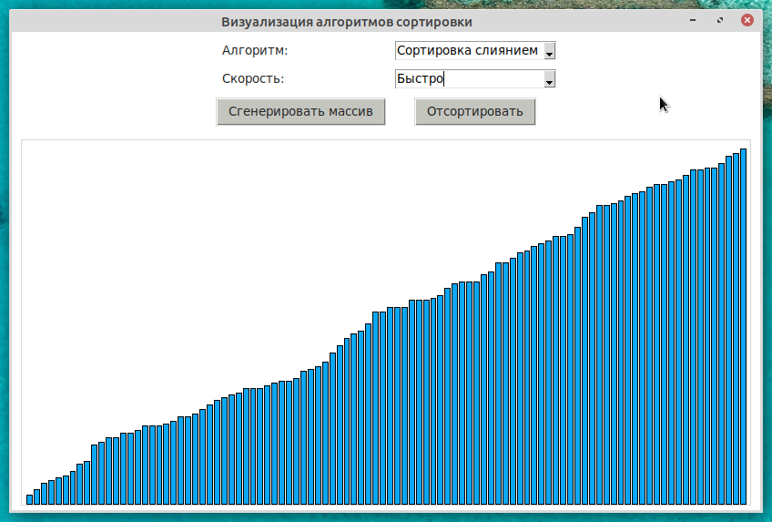

# Визуализатор алгоритмов сортировки
<p>Приложение для визуализации различных алгоритмов сортировки.</p>
<p>Форк проекта https://github.com/FahadulShadhin/Sorting-Algorithms-Visualizer.git</p>
<!-- <table>
  <tr>
    <td></td>
    <td></td>
    <td></td>
  </tr>
</table> -->
<p align='center'></p>

## Алгоритмы сортировки:
* Сортировка пузырьком 
* Сортировка вставками 
* Сортировка выбором
* Сортировка слиянием
* Быстрая сортировка
* Пирамидальная сортировка
* Сортировка подсчетом
* Сортировка "Сталин"

## Используемые инструменты:
* Python 3.8
* Tkinter 8.6

## Скриншоты: 
<p align="center"></p>
<p align="center"></p>
<p align="center"></p> 

## Запуск (Python >= 3.5):
- Клонируем репозиторий
```bash
$ git clone https://github.com/ivekarp/Sorting-Algorithms-Visualizer.git
```
- Запускаем ```main.py```
```bash
$ python3 main.py 
```
